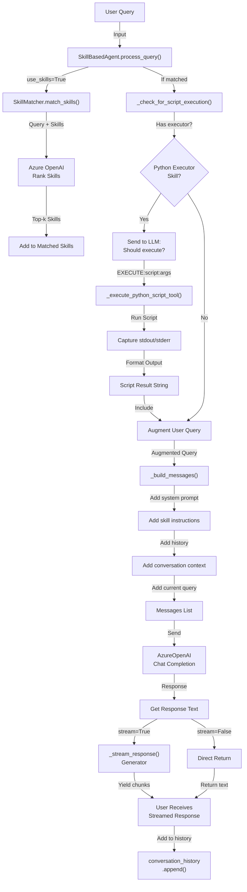

# 🏗️ Skill-Based Agent - Architecture Deep Dive

## Table of Contents

1. [System Architecture](#system-architecture)
2. [Component Interaction](#component-interaction)
3. [Data Flow](#data-flow)
4. [Message Construction](#message-construction)
5. [Skill Matching Pipeline](#skill-matching-pipeline)
6. [Script Execution Pipeline](#script-execution-pipeline)
7. [Error Handling Strategy](#error-handling-strategy)
8. [Performance Characteristics](#performance-characteristics)
9. [Design Patterns](#design-patterns)
10. [Sequence Diagrams](#sequence-diagrams)

---

## 1. System Architecture

### High-Level Architecture

```
┌──────────────────────────────────────────────────────────────────┐
│                        User Interfaces                            │
├──────────────────────────────────────────────────────────────────┤
│  • Streamlit Web UI (streamlit_app.py)                           │
│  • CLI (example.py)                                              │
│  • Python API (direct import)                                    │
└──────────────────────────────────────────────────────────────────┘
                              │
                              ▼
┌──────────────────────────────────────────────────────────────────┐
│              SkillBasedAgent (Orchestrator Core)                  │
├──────────────────────────────────────────────────────────────────┤
│                                                                   │
│  process_query()                                                  │
│  ├─ Match skills                                                 │
│  ├─ Check script execution                                       │
│  ├─ Build messages                                               │
│  ├─ Call LLM                                                     │
│  └─ Stream/return response                                       │
│                                                                   │
└──────────────────────────────────────────────────────────────────┘
      │                      │                      │
      ▼                      ▼                      ▼
┌──────────────────┐  ┌─────────────────┐  ┌────────────────────┐
│ SkillMatcher     │  │ AzureOpenAI     │  │ SkillLoader        │
│                  │  │ Client          │  │                    │
│ • match_skills() │  │                 │  │ • load_skills()    │
│ • LLM ranking    │  │ • Chat API call │  │ • get_skill()      │
│                  │  │ • Streaming     │  │ • skill cache      │
└──────────────────┘  └─────────────────┘  └────────────────────┘
      │                      │                      │
      ▼                      ▼                      ▼
  ┌────────┐            ┌──────────┐           ┌─────────┐
  │ Azure  │            │ Azure    │           │ skills/ │
  │ OpenAI │            │ OpenAI   │           │ *.md    │
  │ Models │            │ API      │           │         │
  └────────┘            └──────────┘           └─────────┘
```

### Component Separation

**Responsibility Distribution:**

| Component | Responsibility | Dependencies |
|-----------|-----------------|--------------|
| **SkillBasedAgent** | Orchestration, query routing, response composition | All others |
| **SkillMatcher** | Intelligent skill selection | AzureOpenAIClient, SkillLoader |
| **SkillLoader** | Skill discovery, metadata extraction | File system |
| **AzureOpenAIClient** | LLM API communication | Azure OpenAI |
| **ScriptExecutor (tools.py)** | Safe script execution | Subprocess, filesystem |

---

## 2. Component Interaction

### Initialization Sequence

```python
# When SkillBasedAgent is instantiated:

1. __init__()
   ├─ Create AzureOpenAIClient()
   │  └─ Authenticate (API key or Azure AD)
   │
   ├─ Create SkillLoader()
   │  ├─ Scan skills/ directory
   │  ├─ Read SKILL.md files
   │  └─ Cache skill metadata
   │
   ├─ Create SkillMatcher()
   │  ├─ Reference to SkillLoader
   │  └─ Reference to AzureOpenAIClient
   │
   └─ Initialize ScriptExecutor
      └─ Verify executor module exists
```

### Runtime Interaction

```
User Query Input
    │
    ▼
process_query()
    │
    ├─────────────────────────┬──────────────────┬─────────────────┐
    ▼                         ▼                  ▼                 ▼
skill_matcher.      _check_for_script_    _build_messages()   conversation_
match_skills()      execution()           (system + history)  history.append()
    │                       │                  │                 │
    ├─ LLM ranks        ├─ If executor   ├─ Format skills   └─ Store user
    │   skills          │   skill found  │   in system       message
    │                   │                │   prompt
    └─ Return top-k     ├─ LLM asks      │
       Skill objects    │   "execute?"   ├─ Add conversation
                        │                │   history
                        ├─ Parse         │
                        │   response     ├─ Add current
                        │                │   query
                        └─ If yes:       │
                            Execute     └─ Return message
                            script      list

                            │
                            ▼
                    Format result
                        │
                        └─ Return script
                           output
                            │
                            ▼
                    Include in
                    system prompt
                            │
                            ▼
                    LLM responds
                    with context
```

---

## 3. Data Flow

### Query Processing Flow



### Message Construction

```
System Prompt (Static + Dynamic)
├─ Core Instructions
│  └─ "You are a helpful AI assistant..."
│
├─ Skill Instructions (if matched)
│  ├─ Skill 1: code-assistant
│  │  └─ [Full SKILL.md content]
│  ├─ Skill 2: data-analysis
│  │  └─ [Full SKILL.md content]
│  └─ ...
│
├─ Script Execution Context (if executed)
│  └─ "A script was executed. Output is below."
│
└─ General Guidance
   └─ "Follow skill instructions carefully..."

Conversation History (Last N messages)
├─ Previous user message 1
├─ Previous assistant response 1
├─ Previous user message 2
├─ Previous assistant response 2
└─ ... (up to 10 messages)

Current User Message
└─ [Original query or query + script output]
```

---

## 4. Message Construction

### System Prompt Building

```python
def _build_messages(self, user_query, matched_skills, script_output):
    messages = []
    
    # Step 1: Create base system prompt
    system_content = """You are a helpful AI assistant..."""
    
    # Step 2: Add skill instructions if available
    if matched_skills:
        system_content += "\n## ACTIVE SKILLS\n"
        for skill in matched_skills:
            system_content += f"### {skill.name}\n"
            system_content += skill.instructions  # Full SKILL.md content
    
    # Step 3: Add script execution context if applicable
    if script_output:
        system_content += "\n## SCRIPT EXECUTION\n"
        system_content += "Output is included in the user's message..."
    
    messages.append({"role": "system", "content": system_content})
    
    # Step 4: Add conversation history (last 10 messages, minus current)
    for msg in recent_history[:-1]:
        messages.append(msg)
    
    # Step 5: Add current user message
    messages.append({"role": "user", "content": user_query})
    
    return messages
```

### Token Optimization

```
Total Available Tokens: 4000 (from config)

Breakdown:
├─ System Prompt: ~1500 tokens
│  ├─ Base instructions: ~300
│  ├─ Skill instructions: ~1000 (varies)
│  └─ Other context: ~200
│
├─ Conversation History: ~1000 tokens
│  └─ Last 10 messages, ~100 tokens each
│
├─ Current User Query: ~200 tokens
│
└─ Reserved for Response: ~1300 tokens
   └─ Allows ~1300 tokens of output
```

---

## 5. Skill Matching Pipeline

### LLM-Based Skill Matching

```
User Query: "Write a Python function to process a CSV file"
                    │
                    ▼
        Available Skills:
        1. Code Assistant
           "Help with programming tasks..."
        2. Data Analysis
           "Analyze data from various sources..."
        3. Writing Assistant
           "Help with writing and content creation..."
                    │
                    ▼
        Matching Prompt:
        "Analyze this query and return skill numbers
         most relevant to help. Return comma-separated
         numbers (e.g., '1, 2') or 'none'"
                    │
                    ▼
        Azure OpenAI Response: "1, 2"
                    │
                    ▼
        Parse Response:
        - Extract numbers [1, 2]
        - Get Skill objects [CodeAssistant, DataAnalysis]
        - Take top_k (default 3)
                    │
                    ▼
        Return: [CodeAssistant, DataAnalysis]
```

### Matching Algorithm Details

```python
def _llm_match(self, user_query, skills, top_k):
    # 1. Create skill list for prompt
    skill_list = []
    for i, skill in enumerate(skills, 1):
        skill_list.append(f"{i}. {skill.name}: {skill.description}")
    
    # 2. Create matching prompt with examples
    system_prompt = """You are a skill matcher.
    Select the most relevant skills by returning only
    numbers (1, 2, 3...) or 'none'."""
    
    user_prompt = f"""Query: "{user_query}"
    
    Skills:
    {skill_list}
    
    Which skills help? (comma-separated numbers or 'none')"""
    
    # 3. Send to LLM
    response = azure_client.chat_completion(
        messages=[...],
        temperature=0.3,  # Low temperature for consistency
        max_tokens=50     # Short response expected
    )
    
    # 4. Parse response
    result = response.choices[0].message.content.strip()
    # "1, 2" or "none"
    
    # 5. Extract and return matched skills
    if result.lower() == "none":
        return []
    
    numbers = [int(n.strip()) for n in result.split(',')]
    matched = [skills[n-1] for n in numbers if 1 <= n <= len(skills)]
    return matched[:top_k]
```

### Fallback Strategy

```
Match Attempt 1: Parse LLM response
    ├─ Success → Return matched skills
    └─ Failure → Fall to next
        │
        ▼
Match Attempt 2: Check for valid numbers
    ├─ Success → Return parsed skills
    └─ Failure → Fall to next
        │
        ▼
Match Attempt 3: Return first skill
    ├─ Available → Return [skills[0]]
    └─ Failure → Fall to next
        │
        ▼
Match Attempt 4: Return empty list
    └─ Process without skills
```

---

## 6. Script Execution Pipeline

### Script Detection and Execution

```
Matched Skills Include: python_executor
                │
                ▼
    _check_for_script_execution()
        │
        ├─ Build detection prompt:
        │  "Based on this query, should I execute a script?
        │   If yes: EXECUTE:script_name:arg1,arg2
        │   If no: NO_EXECUTE"
        │
        ├─ Available scripts:
        │  - hello.py
        │  - calculator.py
        │  - fibonacci.py
        │
        └─ List to LLM
                │
                ▼
        LLM Response Analysis
        │
        ├─ If "EXECUTE:..."
        │  │
        │  ├─ Parse: EXECUTE:calculator.py:multiply,5,3
        │  │  └─ script_name = "calculator.py"
        │  │  └─ args = ["multiply", "5", "3"]
        │  │
        │  ├─ Validate script exists
        │  │
        │  └─ Execute:
        │     python skills/python_executor/scripts/calculator.py multiply 5 3
        │     │
        │     ├─ Capture stdout: "Result: 15.0"
        │     ├─ Capture stderr: ""
        │     └─ Exit code: 0
        │         │
        │         ▼
        │     Format result:
        │     ═══════════════════
        │     Skill: python_executor
        │     Script: calculator.py
        │     ═══════════════════
        │     Output:
        │     Result: 15.0
        │     Exit Code: 0
        │     ═══════════════════
        │
        ├─ If "NO_EXECUTE"
        │  └─ Continue without script execution
        │
        └─ If parsing fails
           └─ Log warning, continue without script
```

### Script Execution Implementation

```python
def _execute_python_script_tool(self, script_name, args):
    # 1. Normalize filename
    if not script_name.endswith('.py'):
        script_name += '.py'
    
    # 2. Execute via tools.py
    result = self.execute_script(
        script_name,
        args=args or [],
        timeout=30
    )
    # Returns {
    #     'stdout': str,
    #     'stderr': str,
    #     'returncode': int,
    #     'execution_time': float,
    #     'script_path': str,
    #     'success': bool
    # }
    
    # 3. Format result using tools.py formatter
    formatted = self.format_script_result(result)
    # Returns pretty-printed string
    
    # 4. Return formatted output
    return formatted
```

### Execute Function (tools.py)

```python
def execute_python_script(script_name, args, timeout, capture_output):
    """
    Safe execution wrapper
    
    Steps:
    1. Verify script exists in scripts/
    2. Build command: python script.py arg1 arg2
    3. Execute with timeout
    4. Capture output and exit code
    5. Return structured result
    """
    
    scripts_dir = Path(__file__).parent / "scripts"
    script_path = scripts_dir / script_name
    
    # Validate
    if not script_path.exists():
        raise FileNotFoundError(f"Script not found: {script_path}")
    
    # Build command
    cmd = [sys.executable, str(script_path)] + (args or [])
    
    # Execute with timeout
    try:
        result = subprocess.run(
            cmd,
            capture_output=True,  # Capture stdout/stderr
            text=True,            # Return as strings
            timeout=timeout,      # Kill if takes too long
            cwd=scripts_dir       # Run from scripts directory
        )
        
        return {
            'stdout': result.stdout,
            'stderr': result.stderr,
            'returncode': result.returncode,
            'success': result.returncode == 0,
            'execution_time': elapsed,
            'script_path': str(script_path)
        }
        
    except subprocess.TimeoutExpired:
        return {
            'stdout': '',
            'stderr': f'Timeout after {timeout}s',
            'returncode': -1,
            'success': False,
            'execution_time': timeout,
            'script_path': str(script_path)
        }
```

---

## 7. Error Handling Strategy

### Error Categories and Recovery

```
┌─────────────────────────────────────────────────────────────────┐
│                    Error Handling Strategy                       │
└─────────────────────────────────────────────────────────────────┘

1. Configuration Errors
   └─ Missing environment variables
   └─ Invalid Azure endpoint
   └─ Auth failure
      └─ Recover: Validate config at startup, raise early

2. Skill Loading Errors
   └─ Corrupt SKILL.md
   └─ Missing skill directory
      └─ Recover: Skip skill, log warning, continue with others

3. Skill Matching Errors
   └─ LLM API failure
   └─ Parsing response failure
      └─ Recover: Return first skill or [] → process without skills

4. Script Execution Errors
   └─ Script not found
   └─ Timeout
   └─ Syntax error in script
   └─ Runtime exception in script
      └─ Recover: Capture error, format nicely, continue

5. LLM API Errors
   └─ Rate limit
   └─ Invalid request
   └─ Timeout
      └─ Recover: Raise error to user with explanation

6. Streaming Errors
   └─ Connection interrupted
   └─ Invalid chunk
      └─ Recover: Yield error message, end stream gracefully
```

### Error Handling Code Pattern

```python
def process_query(self, user_query, use_skills=True, stream=False):
    try:
        # Try to match skills
        matched_skills = []
        if use_skills:
            try:
                matched_skills = self.skill_matcher.match_skills(user_query)
            except Exception as e:
                logger.warning(f"Skill matching failed: {e}")
                # Continue without skills
        
        # Try to execute scripts
        script_output = None
        if matched_skills:
            try:
                script_output = self._check_for_script_execution(
                    user_query, matched_skills
                )
            except Exception as e:
                logger.warning(f"Script execution check failed: {e}")
                # Continue without script output
        
        # Build and send messages
        messages = self._build_messages(user_query, matched_skills, script_output)
        
        # Get response (with separate try-catch)
        if stream:
            return self._stream_response(messages)
        else:
            return self._get_response(messages)
    
    except Exception as e:
        logger.error(f"Query processing failed: {e}")
        return f"An error occurred: {str(e)}"
```

---

## 8. Performance Characteristics

### Latency Breakdown (Typical Query)

```
Operation                          Time (ms)    Percentage
────────────────────────────────────────────────────────
Query Input to Process               ~10          0.5%
Skill Matching LLM Call             ~800         40%
Script Detection LLM Call (if)       ~800         40%
Script Execution (if)                ~500         25%
Response Generation LLM Call       ~1000         50%
────────────────────────────────────────────────────────
Total (no script)                  ~1800         100%
Total (with script)                ~2600         100%

Bottleneck: LLM API calls (80% of latency)
```

### Token Usage Breakdown

```
Query: "Write a function to sort a list"

Tokens Used:
├─ System Prompt                    ~1200 (60%)
├─ Skill Instructions               ~600  (30%)
├─ Conversation History             ~150  (7%)
├─ Current Query                    ~50   (2%)
└─ Response Generated               ~1500

Total Input Tokens:    ~2000
Total Output Tokens:   ~1500
Total Tokens:          ~3500 / 4000 (87.5% utilization)
```

### Scaling Characteristics

```
Single User:
└─ Latency: 2-3 seconds per query
└─ Tokens: ~3000 per query
└─ CPU: Minimal (mostly waiting for API)
└─ Memory: ~500MB

10 Users (Sequential):
└─ Latency: 20-30 seconds total
└─ Throughput: 3-5 queries/second
└─ Rate Limit Risk: Azure OpenAI limits

10 Users (Concurrent):
└─ Latency: 2-3 seconds per user
└─ Throughput: 3-5 queries/second total
└─ Rate Limit Risk: HIGH (need async queue)
└─ Architecture Recommendation: Use Celery/Redis
```

---

## 9. Design Patterns

### 1. Strategy Pattern (Authentication)

```python
# In AzureOpenAIClient.__init__()

if Config.AZURE_OPENAI_API_KEY:
    # Strategy 1: API Key
    client = AzureOpenAI(api_key=...)
else:
    # Strategy 2: Azure AD
    credential = DefaultAzureCredential()
    client = AzureOpenAI(azure_ad_token_provider=...)
```

### 2. Adapter Pattern (Script Executor)

```python
# Agent adapts subprocess execution into LLM-friendly output

def _execute_python_script_tool(self, script_name, args):
    # Raw subprocess result
    result = self.execute_script(script_name, args)
    
    # Adapted to LLM context
    formatted = self.format_script_result(result)
    
    # Add to messages as context
    augmented_query = f"{query}\n\n[SCRIPT OUTPUT]\n{formatted}"
```

### 3. Template Method Pattern (Skill Matching)

```python
# SkillMatcher defines the matching process template

def match_skills(self, user_query, top_k=3):
    all_skills = self.skill_loader.get_all_skills()
    matched = self._llm_match(user_query, all_skills, top_k)  # Template method
    return matched

# Subclass or variant could override _llm_match
# with different matching strategy (similarity search, etc.)
```

### 4. Chain of Responsibility (Error Handling)

```
Error occurs in skill matching
    │
    ├─ Catch: Log warning
    ├─ Handle: Continue with [] (no skills)
    │
    Error occurs in script execution
    │
    ├─ Catch: Log warning
    ├─ Handle: Continue with None (no output)
    │
    Error occurs in LLM call
    │
    ├─ Catch: Log error
    └─ Handle: Return error message
```

### 5. Facade Pattern (SkillBasedAgent)

```
Complex subsystems:
├─ Skill matching
├─ Script execution
├─ Message building
├─ Streaming

Simplified interface:
└─ agent.process_query(query, use_skills, stream)

User doesn't need to know about:
- SkillMatcher internals
- AzureOpenAIClient details
- ScriptExecutor logic
```

---

## 10. Sequence Diagrams

### Sequence 1: Simple Query Without Skills

```
User                Agent          SkillMatcher      AzureOpenAI
│                    │                  │                 │
├─ process_query()──→│                  │                 │
│                    │                  │                 │
│                    ├─ match_skills()─→│ (skipped)       │
│                    │ use_skills=False │                 │
│                    │                  │                 │
│                    ├─ _build_messages()                │
│                    │                  │                 │
│                    ├─────────────────────── chat_completion()─→│
│                    │                  │                 │
│                    │                  │                 ├─ Process
│                    │                  │                 ├─ Generate
│                    │                  │                 │
│                    │                  │  ←──────────────┤
│                    │                  │  (Response)     │
│                    │                  │                 │
│                    ├─ _get_response()                  │
│                    │ (extract text)                    │
│                    │                  │                 │
│    ←─────response──┤                  │                 │
│                    │                  │                 │
```

### Sequence 2: Query With Skill Matching and Script Execution

```
User                Agent           SkillMatcher    AzureOpenAI    ScriptExecutor
│                    │                  │                │              │
├─ process_query()──→│                  │                │              │
│                    │                  │                │              │
│                    ├─ match_skills()─→│                │              │
│                    │ use_skills=True  │                │              │
│                    │                  ├─────────────────────────────→│
│                    │                  │ (Rank skills)                 │
│                    │                  │                │              │
│                    │                  │  ←─────────────┤              │
│                    │                  │ "1, 2"         │              │
│                    │                  │                │              │
│                    │ ←─────[Skills]───┤                │              │
│                    │ (code_assistant) │                │              │
│                    │ (python_executor)│                │              │
│                    │                  │                │              │
│                    ├─ _check_for_script_execution()    │              │
│                    │ (has executor)   │                │              │
│                    │                  │                │              │
│                    │                  ├─────────────────────────────→│
│                    │                  │ "Should execute script?"      │
│                    │                  │                │              │
│                    │                  │  ←─────────────┤              │
│                    │                  │ "EXECUTE:      │              │
│                    │                  │  calculator.py"│              │
│                    │                  │                │              │
│                    ├──────────────────────────────────────execute()──→│
│                    │                  │                │              │
│                    │                  │                │              ├─ Validate
│                    │                  │                │              ├─ Run script
│                    │                  │                │              ├─ Capture output
│                    │                  │                │              │
│                    │                  │                │  ←──────────┤
│                    │                  │                │ {result}    │
│                    │                  │                │              │
│                    ├─ Format result & augment query
│                    │                  │                │
│                    ├─ _build_messages()                │
│                    │ (with script output)              │
│                    │                  │                │
│                    │                  ├─────────────────────────────→│
│                    │                  │ (chat_completion)            │
│                    │                  │ (skill instructions in       │
│                    │                  │  system prompt)              │
│                    │                  │                │
│                    │                  │  ←─────────────┤
│                    │                  │ (Response with context)
│                    │                  │                │
│    ←─────response──┤                  │                │
│                    │                  │                │
```

### Sequence 3: Streaming Response

```
User              Agent              AzureOpenAI
│                  │                     │
├─ process_query()→│ stream=True         │
│ (stream=True)    │                     │
│                  ├─ _stream_response()  │
│                  │                     │
│                  ├──────────────────────chat_completion()─→
│                  │ (stream=True)       │
│                  │                     │
│                  │                     ├─ Processing...
│                  │
│                  │  ←─ chunk 1 ────────┤
│                  │
│    ←─ chunk 1 ───┤ yield chunk
│
│                  │  ←─ chunk 2 ────────┤
│                  │
│    ←─ chunk 2 ───┤ yield chunk
│
│                  │  ←─ chunk 3 ────────┤
│                  │
│    ←─ chunk 3 ───┤ yield chunk
│
│                  │  ←─ [EOM] ──────────┤
│                  │
│                  ├─ save to history
│    ←─ [done] ────┤
│
```

---

## Summary of Key Architectural Decisions

| Decision | Choice | Rationale | Trade-off |
|----------|--------|-----------|-----------|
| Skill Matching | LLM-based | Semantic understanding | Slower, costs tokens |
| Skill Integration | System prompt | Always available | Token cost |
| Script Detection | LLM-based | Prevents false executions | Extra API call |
| History Window | Last 10 msgs | Memory efficiency | Context loss |
| Error Handling | Graceful fallback | Always work | May hide issues |
| Authentication | Flexible | Different environments | Extra complexity |
| Streaming | Supported | Better UX | Complex code |

---

**This architecture document serves as a reference for understanding system internals during interviews and implementation reviews.**
